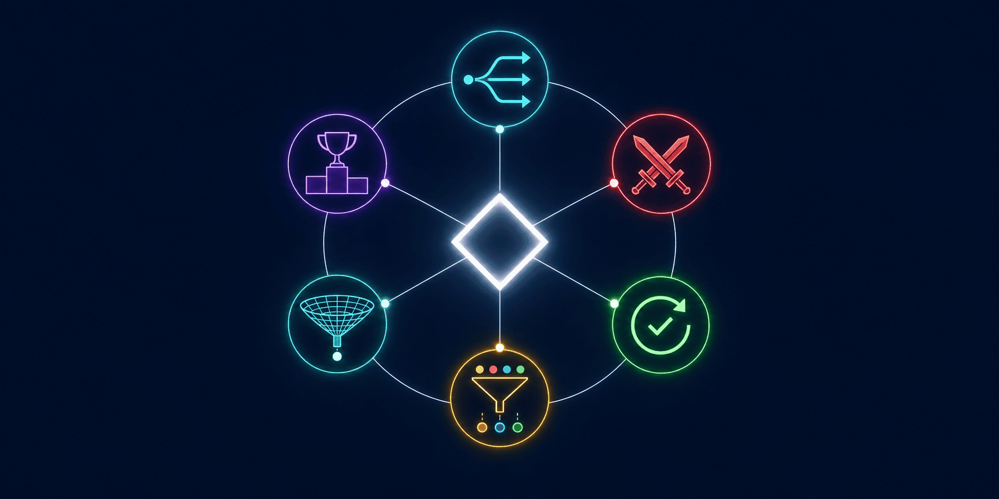

# AI Workflow Patterns



**6 strategies for structuring complex AI tasks. Pick the right pattern before you start - not after you're stuck.**

[](LICENSE)
[](#pattern-selection-matrix)

---

## Problem

You have a complex task. You give it to an AI agent. The agent tries to do everything at once, loses context halfway through, and delivers a mediocre result.

The fix isn't a better prompt - it's choosing the right **execution strategy** before starting.

## Solution

6 workflow patterns. Each solves a different type of complexity. Pick one, apply it, get better results.

---

## Pattern Selection Matrix

For complex tasks (>3 sub-steps or >5 files), choose a strategy BEFORE starting:

| Pattern | When to use | How |
|---|---|---|
| **Fanout & Synthesize** | Independent parallel sub-tasks | Spawn N agents, collect results, synthesize |
| **Adversarial** | Security, deploy, client-facing code | One agent writes, another attacks/reviews blind |
| **Loop Until Done** | Tests, builds, migrations, content | Run - check - fix - repeat until green |
| **Classify & Act** | Mixed input (emails, tickets, logs) | Sort by type first, then handle each type differently |
| **Generate & Filter** | Ideas, options, approaches | Generate many, filter by criteria, keep top N |
| **Tournament** | Best approach unclear | Multiple agents solve same problem differently, judge picks winner |

---

## 1. Fanout & Synthesize

**When:** A task has independent parts that can run in parallel.

```
Task: "Analyze the security of our 3 microservices"

         ┌─ Agent A: analyze auth-service ─┐
Task ────┼─ Agent B: analyze api-gateway  ─┼── Synthesize ── Report
         └─ Agent C: analyze data-service ─┘
```

**Rules:**
- Each agent gets ONLY the context it needs
- Each agent returns ONLY the conclusion
- Synthesizer combines, doesn't re-analyze
- All agents run simultaneously

**Real example:**
- Code review: 3 reviewers (auth, API, DB) in parallel, then combined report
- Research: 3 researchers on 3 topics, then comparison
- Translation: 3 translators for 3 sections, then consistency check

---

## 2. Adversarial

**When:** The output is high-stakes - security, deployment, client-facing code, financial data.

```
Agent A (Builder): implements the solution
          ↓
Agent B (Attacker): reviews BLIND - doesn't see A's reasoning
          ↓
Issues found? → A fixes → B reviews again
No issues? → Ship
```

**Key rule:** The reviewer must NOT see the builder's reasoning or thought process. Only the output. This prevents confirmation bias.

**Real example:**
- Security review: one agent writes auth code, another tries to break it
- Data pipeline: one agent builds ETL, another validates output against source
- Content: one agent writes, another critiques blind (no access to the brief)

---

## 3. Loop Until Done

**When:** You need iterative improvement with measurable quality.

Two variants:

### For code (loop-build)
```
Spec → Build → Adversarial blind review → Fix → Repeat
```

### For content (content-loop)
```
Generate rubric → Produce content → Score 0-100 → Rewrite weaknesses → Repeat
```

**Stop conditions (same for both):**
- Score >= 95% (threshold reached)
- Score delta < 3% between iterations (plateau - no more improvement)
- Max 5 iterations (hard cap - prevent infinite loops)

**When to apply:**
- Any build from spec with >3 requirements -> loop-build
- Any content task where quality is subjective -> content-loop
- Client-facing content -> content-loop with two-agent variant (writer + blind critic)

**When NOT to apply:**
- Single-file fixes, config changes, translations
- Tasks under 10 min
- User says "just do it" or "quick draft"

---

## 4. Classify & Act

**When:** Input is mixed - different types need different handling.

```
Input: 50 customer emails

Step 1 - Classify:
  ├─ Bug reports (12)
  ├─ Feature requests (8)
  ├─ Billing questions (15)
  ├─ Spam (10)
  └─ Praise (5)

Step 2 - Act (different handler per type):
  Bug reports    → create JIRA tickets with severity
  Feature reqs   → add to backlog with priority score
  Billing        → auto-reply with FAQ link
  Spam           → discard
  Praise         → forward to team Slack
```

**Key rule:** Always classify first, then act. Never try to handle mixed input in one pass.

**Real example:**
- Email triage: classify intent, then route to appropriate handler
- Log analysis: classify by severity, then investigate only critical
- Support tickets: classify by topic, then apply topic-specific resolution

---

## 5. Generate & Filter

**When:** You need ideas, options, or approaches - quantity first, quality second.

```
Step 1 - Generate (broad, many):
  Generate 20 headline options for the campaign

Step 2 - Filter (criteria-based):
  Keep only those that:
  - Are under 60 characters
  - Include the product name
  - Have an action verb
  Result: 5 finalists

Step 3 - Rank:
  Score each finalist 1-10 on clarity, urgency, uniqueness
  Pick top 2
```

**Key rule:** Don't self-censor during generation. Filter is a separate step.

**Real example:**
- Blog titles: generate 20, filter by SEO criteria, pick top 3
- Architecture options: generate 5 approaches, filter by constraints, pick best
- Product names: generate 30, filter by availability and trademark, pick finalists

---

## 6. Tournament

**When:** You genuinely don't know which approach is best. Let approaches compete.

```
Problem: "Design the notification system"

Round 1 (parallel):
  Agent A → event-driven with message queue → Solution A
  Agent B → direct API calls → Solution B
  Agent C → hybrid approach → Solution C

Round 2 (judge):
  Judge agent evaluates A vs B vs C on:
  - Implementation complexity
  - Scalability
  - Time to build
  - Maintenance burden
  Winner: C (hybrid)

Round 3 (implement):
  Build Solution C
```

**Key rule:** The judge must not have participated in creating any solution. Fresh perspective.

**Real example:**
- System design: 3 architects propose, judge picks
- Copy: 3 writers draft, blind judge selects
- Algorithm: 3 implementations, benchmark picks winner

---

## Choosing the Right Pattern

```
Is the task decomposable into independent parts?
  Yes → Fanout & Synthesize
  No ↓

Is the output high-stakes (security, money, client-facing)?
  Yes → Adversarial
  No ↓

Does it need iterative quality improvement?
  Yes → Loop Until Done
  No ↓

Is the input mixed (different types need different handling)?
  Yes → Classify & Act
  No ↓

Do you need creative options before committing?
  Yes → Generate & Filter
  No ↓

Are you genuinely unsure which approach to take?
  Yes → Tournament
  No → Just do it directly (no pattern needed)
```

---

## Combining Patterns

Patterns compose naturally:

| Combination | Use case |
|---|---|
| Fanout + Adversarial | Parallel build, then adversarial review of each |
| Classify + Loop | Classify tickets, then loop-fix each category |
| Generate + Tournament | Generate approaches, then tournament to pick best |
| Loop + Adversarial | Each loop iteration includes an adversarial review |

---

## License

Apache 2.0 - see [LICENSE](LICENSE) for details.
